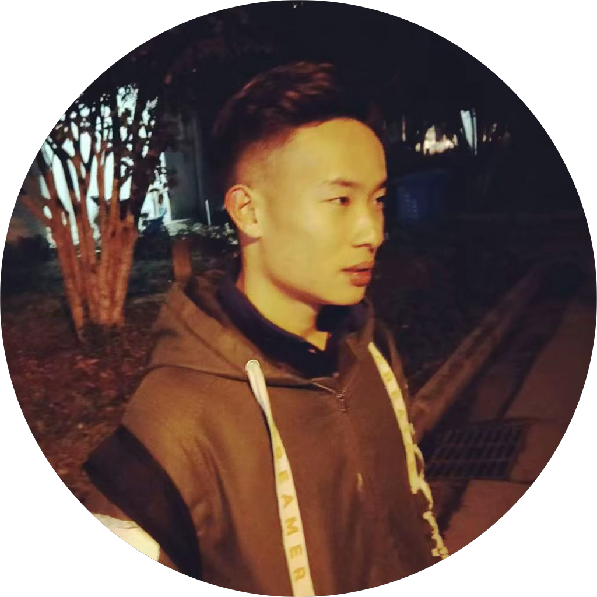
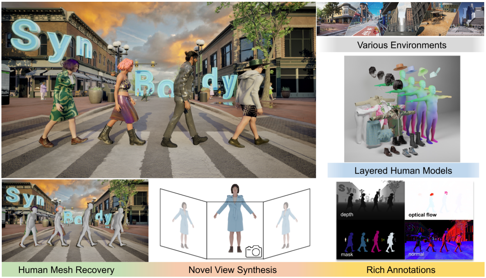
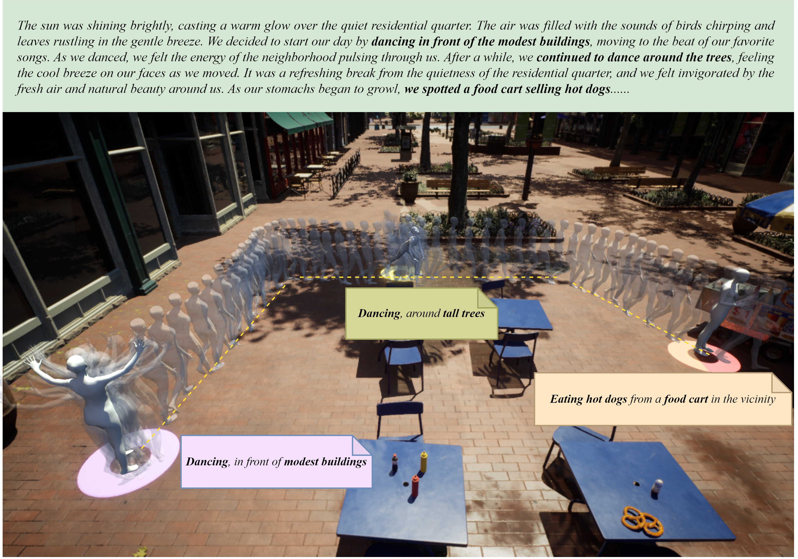

# Zhongfei Qing 卿中飞
****

  

    
  

  

    
M.S.

    
School of Computer Science and Technology

    
University of Chinese Academy of Sciences

  

## Biography
My name is Zhongfei Qing, and I am currently pursuing a master's degree at the University of Chinese Academy of Sciences. In addition to my studies, I am also interning at the Content Generation Group of SenseTime Research, where I work under the guidance of Zhitao Yang and Lei Yang.  
My research interests include:  
**1: Human Motion Generation like audio2Motion and text2Motion is my favorite, my goal is to create vivid NPCs in the virtual world for gaming;**  
**2: Image Segmentation with Large-scale Models;**  
**3: Conditional Image Generation, such as painting via a semantic mask or text description.**  

## Projects

### 1.Synbody: Synthetic Dataset

During my internship at SenseTime, I had the honor of participating in the Synbody project. This experience allowed me to gain hands-on experience in the field and contribute to the success of the project. I am grateful for the opportunity to have been a part of this project and am proud of the work that was accomplished.

### 2.Synbody: Human Motion Synthesis from Script

As part of the Synbody, I was responsible for overseeing a key task, namely character motion planning, and synthesis. This experience provided me with valuable skills and knowledge and allowed me to make meaningful contributions to the project's success. I am proud to have played a part in this project.
